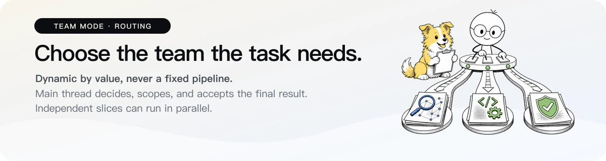

<p align="right">
  <strong>English</strong> · <a href="./README.zh-CN.md">简体中文</a>
</p>

<p align="center">
  
</p>

`team-mode` is a Codex Skill for coordinating three working agents across substantial development, research, analysis, planning, document, data, and content tasks. The main thread keeps unresolved decisions and final acceptance; subagents are used only when context isolation, bounded execution, useful parallelism, verification, or independent judgment has clear net value.

It is a value-based routing guide, not a mandatory pipeline. A task being large or divisible is not, by itself, a reason to spawn more agents.

## The team

- **Explorer · Luna Medium · read-only** — bounded search, tracing, and evidence compression. Medium is intentional: when discovery becomes architecture-defining, high-consequence, or too broad for reliable bounded evidence gathering, return the evidence and uncertainty to the main thread instead of mechanically raising Explorer effort.
- **Executor · Luna xHigh · workspace-write** — implementation, fixes, and tests after scope, business semantics, interfaces, data models, state flows, acceptance checks, and safety boundaries are fixed. xHigh keeps substantial quality headroom over High while reserving Max for genuinely hardest quality-first workloads.
- **Reviewer · Terra High · read-only** — fresh-context independent review of stable artifacts. High gives more reasoning margin for counterexamples, regressions, requirement coverage, and weak assumptions without making Reviewer a second architect.

An optional **default · Luna Low · read-only** dispatch guard is included in the repository. It rejects omitted/default `agent_type` dispatches but is not required by Team Mode and can affect other subagent workflows in the same installation scope.

These defaults do not follow a mechanical “raise every role one level” rule. Use an already-sufficient level for ordinary evidence work, keep more margin where a role mutates artifacts or performs consequential independent judgment, and return decisions beyond a role's boundary to the main thread.

## How routing works

- Team Mode may use no subagents at all. Delegate only when expected benefit clearly exceeds briefing, inspection, waiting, rework, token, and conflict cost.
- Substantial tasks get a brief decomposition pass, but “can be split” does not mean “should be delegated.” Even independent slices are parallelized only when the gain is real.
- Before spawning, the parent must identify a real routing benefit. The child itself receives a compact self-contained packet with `Outcome`, `Sources`, `Scope`, `Checks`, `Stop when`, and `Return` rather than routing boilerplate it does not need.
- Unresolved architecture, product and business semantics, interfaces, data models, state flows, scope, safety, and final acceptance stay in the main thread.
- New children normally start without inherited parent history; new Reviewers always do. Name every factual source the child needs.
- Parallel writers require disjoint, stable ownership. Keep one writer for each file, shared artifact, interactive session, or mutable-system boundary; stop or complete the old writer and state a handoff before ownership changes.
- After a child error, timeout, or interruption, inspect existing artifacts and trace evidence before retrying. Recover usable work instead of automatically repeating it.
- The main thread inspects real sources, diffs, artifacts, and verification. A child's “completed” status is not final acceptance.

## Independent review

Use Reviewer according to **risk and verification difficulty**, not file count.

Fresh review is usually valuable when shared APIs, state, persistence, concurrency, authorization, security, migration, compatibility, or cross-cutting behavior changed; verification is weak; a plausible false success would be costly; the diff is conceptually dense; implementation or tests exposed meaningful uncertainty; or the user explicitly asks for independent review.

Use **one risk-focused Reviewer by default**. Frame the unresolved risk neutrally as a question to test, not a suspected defect or desired verdict. Add another Reviewer only for a genuinely independent unresolved risk whose expected value exceeds the additional briefing and inspection cost.

## Install

Install this fork's Skill:

```bash
npx skills add jinhongel/codex-team-mode
```

The Skill and custom Agent profiles are separate. Install the three required working profiles from [`agents/`](./agents):

- `Explorer.toml`
- `Executor.toml`
- `Reviewer.toml`

Personal profile directories are typically `%USERPROFILE%\.codex\agents\` on Windows and `~/.codex/agents/` on macOS/Linux. For one project, use `<repository>/.codex/agents/`.

`default.toml` is an **optional strict dispatch guard**. Do not install it globally unless you want omitted/default subagent dispatches from other Codex workflows in that scope to fail closed as well.

See [Custom Agent Profiles](./skills/team-mode/references/custom-agents.md) for safe installation, runtime validation, permission caveats, and model customization. Open a new Codex task or restart Codex if newly installed profiles do not appear immediately.

## Use

The Skill can trigger automatically when delegation has clear value, or you can invoke it directly:

```text
Use $team-mode for this task. Delegate only when the benefit clearly exceeds coordination cost, and keep unresolved decisions and final acceptance in the main thread.
```

You do not need to name every agent yourself. The main thread decides whether to delegate, selects roles, controls concurrency, and remains responsible for the combined result.

## Customize

You can change `model` and `model_reasoning_effort` in `agents/*.toml`, but do not mechanically minimize token use and do not mechanically raise every role just because a higher setting exists. Judge representative tasks by correctness, omissions, rework, verification burden, and usage. Keep Explorer and Reviewer read-only, mutation permissions with Executor, new reviews fresh, and final decisions in the main thread.

## Repository layout

```text
codex-team-mode/
├── agents/                  # Three required working profiles + optional dispatch guard
├── assets/readme/           # README visuals
├── skills/team-mode/        # Installable Skill
│   ├── agents/openai.yaml
│   ├── references/          # Setup, evaluation, and testing guidance
│   ├── scripts/usage_by_model.py
│   └── SKILL.md
├── tests/                   # Agent, routing, and usage regression tests
├── LICENSE
└── README.md
```

MIT License
